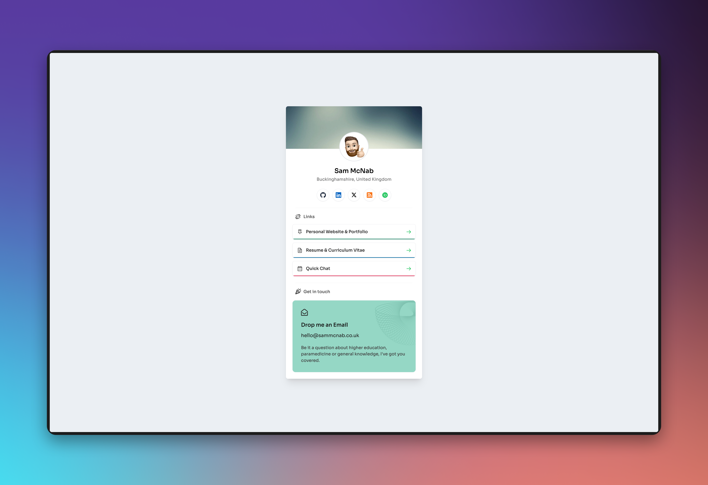

<!-- TOP ROW OF BADGES -->
<div align="center">
  
|     |     |     |     |     |
|:---:|:---:|:---:|:---:|:---:|
| [![Contributors][contributors-shield]][contributors-url] | [![Forks][forks-shield]][forks-url] | [![Stargazers][stars-shield]][stars-url] | [![Issues][issues-shield]][issues-url] | [![MIT License][license-shield]][license-url] |
| [![Demo][demo-shield]][demo-url] | [![Deploy with Vercel][vercel-button]][vercel-url] | [![Build][build-shield]][build-url] | [![Version][version-shield]][version-url] | [![Last Commit][commit-shield]][commit-url] |

</div>
<a name="readme-top"></a>

<!-- PROJECT LOGO -->
<br />
<div align="center">
  <a href="https://github.com/smcnab1/personal-links">
    
  </a>

<h3 align="center">Personal Links</h3>

  <p align="center">
    A fast, accessible, self-hosted link-in-bio site — minimal, responsive, and easy to maintain.
    <br />
    <a href="https://contact.sammcnab.co.uk"><strong>View Demo »</strong></a>
    <br />
    <br />
    <a href="https://github.com/smcnab1/personal-links/issues/new?template=1-bug-report.md">Report Bug</a>
    ·
    <a href="https://github.com/smcnab1/personal-links/issues/new?template=3-feature-request.md">Request Feature</a>
  </p>
</div>

<details>
  <summary>View Contents</summary>

_Last Updated 1 September 2025_

<!-- toc -->

- [About The Project](#about-the-project)
  - [Features](#features)
  - [Built with](#built-with)
- [Getting started](#getting-started)
  - [Prerequisites](#prerequisites)
  - [Install](#install)
  - [Usage](#usage)
- [Back Matter](#back-matter)
  - [Roadmap](#roadmap)
  - [Contributing](#contributing)
  - [License](#license)

<!-- tocstop -->

</details>

<!-- ABOUT THE PROJECT -->

## About The Project

<div align="center">
  <a href="https://github.com/smcnab1/personal-links">
    
  </a>
</div>
  
**Personal Links** is a lightweight link-in-bio site you can host yourself. It focuses on performance, accessibility, and a simple editing workflow so you can keep your public links up to date without fuss.

<p align="right">(<a href="#readme-top">back to top</a>)</p>

### Features

- ⚡ **Fast & responsive** by default (mobile-first, lighthouse-friendly)
- ♿ **Accessible** structure and semantics
- 🧩 **Simple content model** — keep links in one place, easy to edit
- 🌓 **Dark/light mode** friendly styling
- 🔍 **SEO-ready** metadata & share cards (Open Graph)
- 🚀 **Easy deploys** to Vercel/GitHub Pages (static export supported)

### Built with

- Next.js & TypeScript
- Tailwind CSS
- PNPM
- Vercel (recommended deploy target)

<p align="right">(<a href="#readme-top">back to top</a>)</p>

## Getting started

### Prerequisites

- Node.js 18+ (20+ recommended)
- PNPM installed (`npm i -g pnpm`) — or use NPM/Yarn if preferred

### Install

[![Deploy with Vercel][vercel-button]][vercel-url]

```bash
# 1) Clone
git clone https://github.com/smcnab1/personal-links.git
cd personal-links

# 2) Install deps
pnpm install

# 3) Run locally
pnpm dev
```

Optional environment variables (if you add analytics or custom meta) can be placed in `.env.local`.

### Usage

- **Add or edit links:** update your links data/component in `src/` (e.g. a `links.ts` or the relevant section in your page component).
- **Branding:** replace images in `images/` and `public/` (e.g. avatar, social preview).
- **Build & Export:**

  ```bash
  pnpm build && pnpm start        # production server
  # or, for static export if configured:
  pnpm build && pnpm export
  ```

- **Deploy:** deploy the repo to Vercel (zero-config) or serve the static export via GitHub Pages/another host.

<p align="right">(<a href="#readme-top">back to top</a>)</p>

## Back Matter

### Roadmap

See the [open issues](https://github.com/smcnab1/personal-links/issues) for a full list of proposed features (and known issues).

<p align="right">(<a href="#readme-top">back to top</a>)</p>

<a name="contributing"></a>

### Contributing

Contributions are welcome — thank you!
If you have suggestions, please open an issue (use the **enhancement** or **feature-request** labels) or submit a PR.

1. Fork the project
2. Create your feature branch (`git checkout -b feature/amazing-feature`)
3. Commit your changes (`git commit -m "feat: add amazing feature"`)
4. Push to the branch (`git push origin feature/amazing-feature`)
5. Open a Pull Request

### License

This project is licensed under the [MIT License](LICENSE.md).

<p align="right">(<a href="#readme-top">back to top</a>)</p>

<!-- MARKDOWN LINKS & IMAGES -->

[contributors-shield]: https://img.shields.io/github/contributors/smcnab1/personal-links.svg?style=plastic
[contributors-url]: https://github.com/smcnab1/personal-links/graphs/contributors
[forks-shield]: https://img.shields.io/github/forks/smcnab1/personal-links.svg?style=plastic
[forks-url]: https://github.com/smcnab1/personal-links/network/members
[stars-shield]: https://img.shields.io/github/stars/smcnab1/personal-links.svg?style=plastic
[stars-url]: https://github.com/smcnab1/personal-links/stargazers
[issues-shield]: https://img.shields.io/github/issues/smcnab1/personal-links.svg?style=plastic
[issues-url]: https://github.com/smcnab1/personal-links/issues
[license-shield]: https://img.shields.io/github/license/smcnab1/personal-links.svg?style=plastic
[license-url]: https://github.com/smcnab1/personal-links/blob/master/LICENSE.md
[vercel-button]: https://img.shields.io/badge/Deploy%20with-Vercel-000?style=plastic&logo=vercel&logoColor=white
[vercel-url]: https://vercel.com/new/clone?repository-url=https%3A%2F%2Fgithub.com%2Fsmcnab1%2Fpersonal-links&project-name=personal-links&repository-name=personal-links&redirect-url=https%3A%2F%2Fgithub.com%2Fsmcnab1&demo-title=Personal%20Links%20%E2%80%94%20Fast%2C%20Accessible%20Link-in-Bio&demo-description=Minimal%2C%20responsive%20link%20hub%20built%20with%20Next.js%20and%20Tailwind.%20SEO%20meta%2C%20and%20simple%20content%20updates.%20Deploy%20to%20Vercel%20in%20one%20click.&demo-url=https%3A%2F%2Fcontact.sammcnab.co.uk&demo-image=https%3A%2F%2Fgithub.com%2Fsmcnab1%2Fpersonal-links%2Fblob%2Fmaster%2Fimages%2Fscreenshot.png%3Fraw%3Dtrue
[repo-size-shield]: https://img.shields.io/github/repo-size/smcnab1/personal-links?style=plastic&logo=github
[repo-url]: https://github.com/smcnab1/personal-links
[demo-shield]: https://img.shields.io/website?url=https%3A%2F%2Fcontact.sammcnab.co.uk%2F&up_message=live&style=plastic&label=demo
[demo-url]: https://contact.sammcnab.co.uk
[build-shield]: https://img.shields.io/github/checks-status/smcnab1/personal-links/master?style=plastic
[build-url]: https://github.com/smcnab1/personal-links/actions
[version-url]: https://github.com/smcnab1/personal-links/releases
[version-shield]: https://img.shields.io/github/v/release/smcnab1/personal-links?style=plastic
[commit-shield]: https://img.shields.io/github/last-commit/smcnab1/personal-links?style=plastic
[commit-url]: https://github.com/smcnab1/personal-links/commits/
